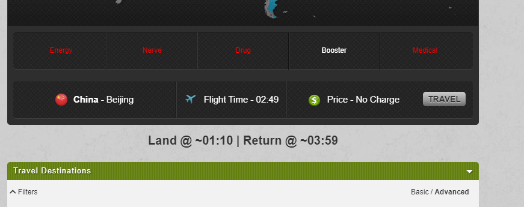

# TORN Flight Times

Userscript for [TORN](https://www.torn.com/) to show landing times in your timezone before flying:

## Installation

1. Install GreaseMonkey or TamperMonkey extension in your browser.
2. Navigate to: https://github.com/juzraai/torn-flight-times/raw/main/torn-flight-times.user.js
3. GM/TM should automatically detect that it's a userscript and offer installation

If that doesn't happen automatically:

1. Copy the contents of the linked userscript above
2. Create a new script in GM/TM settings
3. Paste the script contents and save

## Future ideas

- Show actual landing times on the flying page without API calls

## Contributing

Feel free to open a ticket with ideas or bugs, or a pull request with fixes.

## License

MIT, see [LICENSE](LICENSE) file.