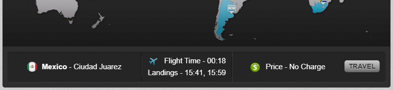
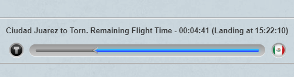

# TORN Flight Times

*Userscript for [TORN](https://www.torn.com/) to show landing times in your timezone before and during the flight. No API key required.*

---

## Features

On the Travel Agency page, it shows the time of landing in the city and the time of landing back in Torn (supposing you won't spend time in the city), in your timezone, based on the displayed *"Flight Time"*:

This helps you choose the best fitting destination for your RL schedule.

Be aware that [actual flight time may be a bit different](https://wiki.torn.com/wiki/Travel), so always check the actual landing time after taking off:

> There is a variance of 3% on flight times, this explains small discrepancies in the flight times you might notice.

When flying, the script shows the actual landing time in your timezone, based on *"Remaining Flight Time"*:

## Installation

1. Install GreaseMonkey or TamperMonkey extension in your browser.
2. Navigate to: https://github.com/juzraai/torn-flight-times/raw/main/torn-flight-times.user.js
3. GM/TM should automatically detect that it's a userscript and offer installation

If that doesn't happen automatically:

1. Copy the contents of the linked userscript above
2. Create a new script in GM/TM settings
3. Paste the script contents and save

## Contributing

Feel free to open a ticket with ideas or bugs, or a pull request with fixes.

## License

MIT, see [LICENSE](LICENSE) file.